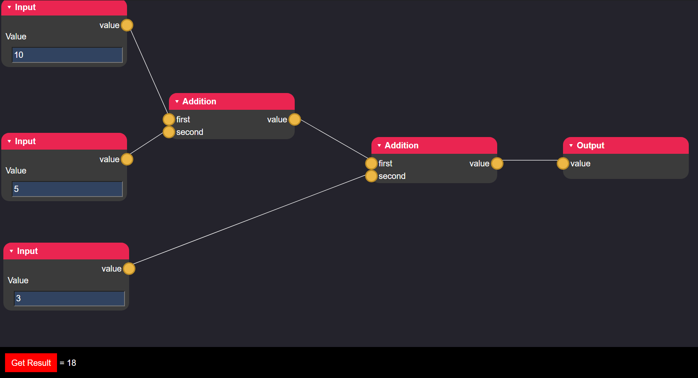

# NodeEditor
Qkmaxware.Blazor.NodeEditor is a .net 5 library for Blazor which provides a reusable component for creating node-editor user interfaces. 

Node-editors are graphical editors designed allows users to compose complicated sequences of events while hiding the computational complexity of each of the individual steps. It does this by creating "nodes" representing each step in a process. Edges connect the outputs of one node to the inputs of another node allowing data to move through the process until it reaches the end.

- [NodeEditor](#nodeeditor)
  - [License](#license)
  - [Example](#example)
  - [Tutorials](#tutorials)
    - [Creating Custom Node Types](#creating-custom-node-types)
    - [Nodes With User Defined Parameters](#nodes-with-user-defined-parameters)
      - [Custom Property Drawers](#custom-property-drawers)


## License
See [License](LICENSE.md) for license details.

## Example
An example of how to use and customize the node-editor can be shown in the [Test](Test) directory of this repo. 



## Tutorials
### Creating Custom Node Types
No types of nodes are provided in this library as the types of nodes that are used are specific to each use case. You can see a larger example in the [Test](Test\Data\NodeTypes.cs) project. All nodes for processes must extend from the **ProcessStep** class. The constructor for each node type should declare the allowed inputs and outputs for that node. In the **Recalculate** method all the outputs should have their values set or else the system may try to re-compute the outputs each time it is used rather than using cached results.
```cs
public class AdditionNode : ProcessStep {
    public AdditionNode() {
        this.Name = "Addition";
        this.Inputs = new NodePortCollection(new NodePort[]{
            new NodePort<float> {
                Name = "first"
            },
            new NodePort<float> {
                Name = "second"
            }
        });
        this.Outputs = new NodePortCollection(new NodePort[]{
            new NodePort<float> {
                Name = "value"
            }
        });
    }

    public override void Recalculate() {
        var t1 = this.Inputs["first"].Fetch<float>();
        var t2 = this.Inputs["second"].Fetch<float>();

        this.Outputs["value"].Store(t1 + t2)
    }
}
```
### Nodes With User Defined Parameters
In may contexts, it becomes important to ask the process designer for information that is important to how the process run. For example maybe choosing an image file for editing, changing the freqency of a noise generator, or choosing an email address to send reports to. These are provided by the **ParametreizedProcessStep<T>** class. The generic argument determines a data-class which is used as the parameter set for the node. This allows the node access to a new variable **Parametres** which will automatically bind all public properties to input fields in Blazor.  
```cs
public class MyNodeParams {
    public float MyFloat {get; set;}
    public bool MyBool {get; set;}
    public string MyText {get; set;}
}
public class MyNode : ParametreizedProcessStep<MyNodeParams> {
    public MyNode() {
        this.Parametres = new MyNodeParams();
        ...
    }
}
```
By default the following property types for a node's parametres can be automatically bound to Blazor input fields.
| Type | HTML Field Type |
|------|------------|
| int | number |
| long | number |
| float | number |
| double | number |
| bool | checkbox |
| string | text |
| enum | select |

#### Custom Property Drawers
Sometimes there may be situations where you want to provide a property for an input parameter but its for a type that is not supported by default (like a file loader). In these cases you will need to provide a custom property drawer to tell the node-editor how to draw and bind that property. This is done by annotating the property with **CustomPropertyDrawer** annotation and providing it with the type of a class that extends from **BasePropertyDrawer** which will be drawn in place of an input field. This base class provides two protected fields **Instance** which coorelates to the object instance the parametre value exists within and **Property** which is the property type reflection of the exact property being drawn.
```cs
public class CustomPropertyParams {
    [CustomPropertyDrawer(typeof(BitmapPropertyDrawer))]
    public Uri Image {get; set;}
}
public class MyCustomPropertyNode : ParametreizedProcessStep<CustomPropertyParams> {
    ...
}
```
```html
// BitmapPropertyDrawer.razor
@using Qkmaxware.Blazor.NodeEditor.Components
@inherits BasePropertyDrawer


```